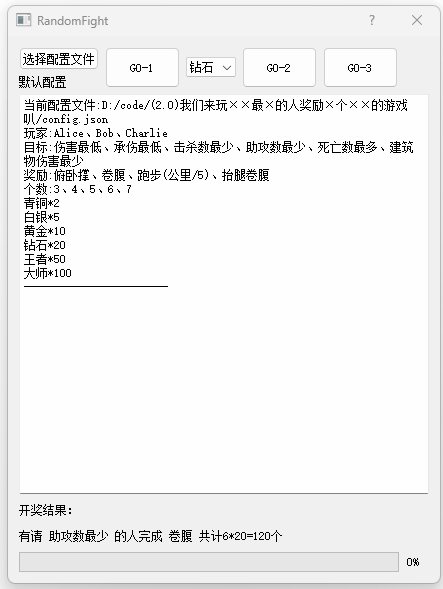

# 大乱斗随机奖励工具



1、定制配置文件

根据需求定制不同的配置文件

```
{
  "player":
   ["Alice", "Bob", "Charlie" ],
  "goal": 
  ["伤害最低",  "承伤最高",  "击杀数最多",   "助攻数最多",  "死亡数最多",  "建筑物伤害最多" ],
  "reward":
   [ "俯卧撑", "卷腹", "跑步(公里/5)", "抬腿卷腹"
  ],
  "base_number": [ 1, 2,  3, 4,  5,  6, 7,  8,  9,  10 ],
  "multiplying": [ 2, 5, 10, 20, 50,  100 ]
}
```

2、共3次开奖机会

who ?

do what ?

how mush ?

```
    def go1(self):
        """ Who ? """
        self.random_goal = random.choice(self.goal)
        self.ui.plainTextEdit.appendPlainText(f"有请 {self.random_goal} 的人")
        self.result1 = f"有请 {self.random_goal} 的人"

    def go2(self):
        """ Do What ? """
        self.random_reward = random.choice(self.reward)
        self.ui.plainTextEdit.appendPlainText(f"完成 {self.random_reward}")
        self.result2 = f"完成 {self.random_reward} "

    def go3(self):
        """ How Much """
        self.ui.label_input_2.setText("")
        # random_goal = random.choice(self.goal)
        # random_reward = random.choice(self.reward)
        self.random_base_number = random.choice(self.base_number)
        self.random_multiplying = self.multiplying[int(self.ui.comboBox.currentIndex())]
        total = self.random_base_number * self.random_multiplying
        self.result3 = self.result1 + self.result2 + f"共计{self.random_base_number}*{self.random_multiplying}={total}个"
        self.ui.plainTextEdit.appendPlainText(f"共计{self.random_base_number}*{self.random_multiplying}={total}个")
        self.ui.label_input_2.setText(self.result3)
        self.ui.plainTextEdit.appendPlainText("------------------------")
```
3、直接下载release里的exe文件，开始和小伙伴们快乐的Van耍吧！

